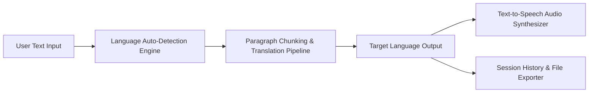

# Neural Language Translation Workspace

A responsive, multilingual translation platform supporting over 100+ global languages, real-time language auto-detection, neural speech synthesis (TTS), text chunking, and session history management.

## Project Highlights
- **100+ Supported Languages:** Neural translation with automatic source language detection and bidirectional swapping.
- **Speech Synthesis (TTS):** Integrated audio playback for both source content and translated results using in-memory streaming.
- **Long-Form Text Handling:** Automatic paragraph chunking architecture to preserve formatting and bypass standard API rate ceilings.
- **Telemetry & Word Metrics:** Dynamic word counter, character counter, and latency performance tracking.
- **Session History & Export:** Real-time log of translation requests with one-click JSON export.
- **Anti-Slop Design System:** Strict UI compliance documented in `DESIGN.md` featuring Geist typography and Zinc-950 color discipline.

## CodeAlpha Task 1 Compliance
- **Interactive UI:** Dual-pane workbench to input text and select source & target languages.
- **Translation API:** Google Chrome Neural Translation API with MyMemory fallback.
- **Send & Receive:** Low-latency API pipeline with paragraph chunking and auto-detection.
- **Clear Display:** Elevated readout card with latency, word count, and character telemetry.
- **Usability Enhancements:** Instant **Copy to Clipboard** and neural **Text-to-Speech (TTS)** for source and translated text.

---

## Architecture Flow



---

## Project Structure

```
CodeAlpha_Language_Translation_Tool/
├── src/
│   ├── __init__.py
│   ├── constants.py    # Language registries and clean visual tokens
│   ├── translator.py   # Translation service and multi-paragraph chunker
│   ├── tts.py          # In-memory text-to-speech audio streaming engine
│   └── history.py      # Session history recorder and JSON exporter
├── app.py              # Streamlit multi-language translation workbench
├── DESIGN.md           # Stitch design system specification
├── requirements.txt    # Project dependencies
└── README.md           # Documentation
```

---

## Getting Started

### 1. Prerequisites
- Python 3.10+ (Python 3.11 or 3.12 recommended)
- Git

### 2. Clone and Setup Environment

```bash
git clone https://github.com/potlasrisharan/CodeAlpha_Language_Translation_Tool.git
cd CodeAlpha_Language_Translation_Tool

python3 -m venv .venv
source .venv/bin/activate  # On Windows: .venv\Scripts\activate

pip install -r requirements.txt
```

---

## Usage

### Run Interactive Web Translation Workspace
Launch the application:
```bash
streamlit run app.py
```
Open your browser at `http://localhost:8501`. Enter text into the left pane, choose or swap target languages, click **Translate Text**, listen to the audio readout, or export your translation history.

---

## Submission & LinkedIn Demonstration Notes
To record your video explanation for CodeAlpha internship submission:
1. Run `streamlit run app.py`.
2. Demonstrate translating text across multiple languages (e.g., English -> Spanish, French, German, or Telugu).
3. Demonstrate the **Swap** languages feature and automatic language detection.
4. Play back the synthesized speech using the **Listen Translated Audio** feature.
5. Demonstrate translation history inspection and file download.
6. Post the video on LinkedIn tagging `@CodeAlpha` with your GitHub repository URL.
